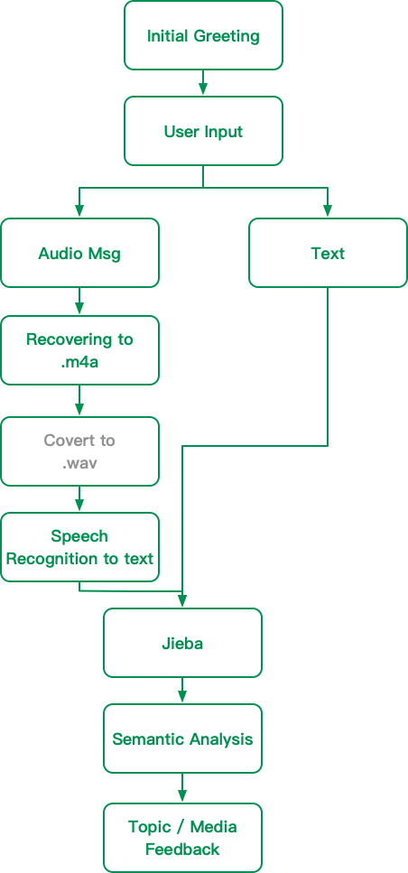

# LINE BOT project with AI tech

孫仔！哩底堆？

## 安裝python

1. 安裝python
2. 安裝 pip 套件管理工具
3. `pip install -r requirement.txt`


基本架構


## ffmpy 問題

需要利用`ngrok`來架伺服器

```
./ngrok http 5000
```

然後每次跑都要複製新的https到line bot後台


----

## GITHUB 帳號轉換找不到repo時
[參見](https://help.github.com/articles/updating-credentials-from-the-osx-keychain/)


https://s19.aconvert.com/convert/p3r68-cdx67/0o2m8-716lt.mp4


## Requirements

line-bot-sdk
flask
SpeechRecognition
Flask-Script
ffmpy


